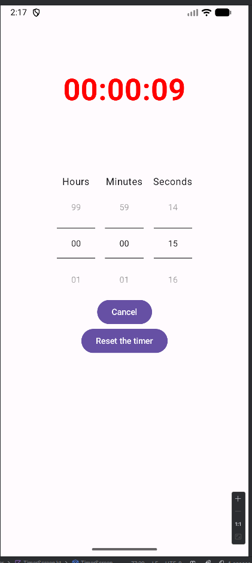

1. Called FibonacciDemoNoBgThrd
2. Created a fibonacci sequence generator using a coroutine
3. Started application using countdownactivity
4. make the text of the timer larger
5. added a toast notification of the timer going to 0
6. add a button to reset the timer
7. play a sound when the timer reaches 0
8. during the last 10 seconds the text is red and bold 